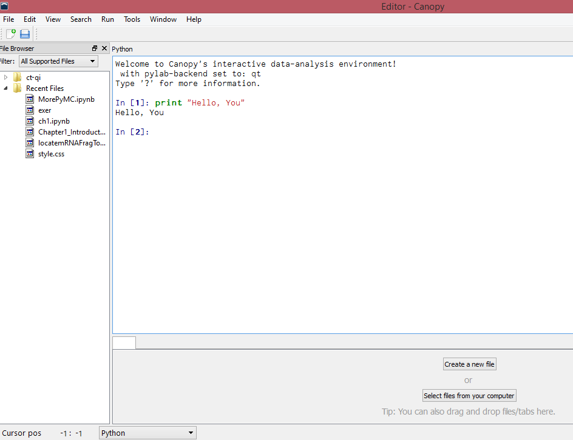
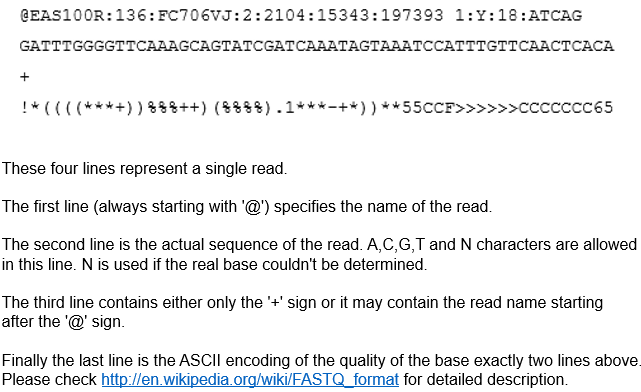

Python training tutorial
===
Chen Tong
=============

Welcome to my python tutorial, enjoy it. Please also refer to one classical
introduction for python usage named [A byte of
python](http://www.byteofpython.info/) and its [chinese
version](http://woodpecker.org.cn/abyteofpython_cn/chinese/index.html) to get
more understanding of *Python*.

This work is licensed under a <a rel="license"
href="http://creativecommons.org/licenses/by-nc-sa/2.0/">Creative Commons
Attribution-NonCommercial-ShareAlike 2.0 Generic License</a>.

# Introduction

## Why I choose Python

* Simple. Just read and write as you think.
* Powerful. Active community and amounts of gorgeous standard and third-party
packages.
* Scalacity. Easily to ge fused with C and C++.

## How to install Python

Normally, I would recommend newbies try
[Anacodna](https://store.continuum.io/cshop/anaconda/) (free to everybody) and
[Canopy](https://www.enthought.com/products/canopy/) (free to education and
academy). These two python distributions intergated many useful scientific
computation Python packages, saving you lots of time to fix annoying
incompatibility-problems.

## How to run Python commands and scripts

* For Linux/Unix users, one just typing `python` in the terminal and hitting
`Enter` would start the interctive Python interpreter just as showed below. Then
any operations can be typed in directly and run by hitting `Enter`. Also all the
commands can be saved in a file, here for example `test.py` and simply type
`python test.py` will run the commands.  

* For Windows users, an interactive Python interpreter can be invoked by double-
clicking `python.exe` or `Canopy` if installed. Files containing python source
codes can be loaded directly to these interpreters to get run. 

* Press `Ctrl-d` and `Ctrl-z` would let you quit interactive Python interpreter
in Linux/Unix or Windows systems respectively.

*

* Since this tutorial is written and distributed using `IPython Notebook`, it
would be a great way to directly run codes within this document under `IPython
Notebook` environment.

## What editor should I use

Normally, I would recommend [Vim](http://www.vim.org/download.php) to edit
Python scripts as well as other scripts. A detailed configuration of `vim` for
linux can be found at [my github](https://github.com/Tong-Chen/vim) and
[BaiDuYun](http://pan.baidu.com/s/1kT5KIN1) for Windows.

# Basic concepts

* 合适的缩进。空白在Python中是重要的。事实上行首的空白是重要的。它称为缩进。在逻辑行首的空白（空格和制表符）用来决定逻辑行的缩进层次，从而用来决定语句的
分组。这意味着同一层次的语句必须有相同的缩进。每一组这样的语句称为一个块。
* 常量, 指固定的数字或字符串，如`2`, `2.9`, `Hello world`等。
* 变量, 存储了数字或字符串的事物称为变量，它可以被赋值或被修改。简单的可以理解为变量是一个盒子，你可以把任何东西放在里面，通过盒子的名字来去除盒子内的东西。
    * 数值变量：存储了数的变量
    * 字符串变量：存储了字符串的变量
    * 列表(list): list是处理一组有序项目的数据结构，即你可以在一个列表中存储一个 序列 的项目。假想你有一个购物列表，上面记载着你要买的东西，
你就容易理解列表了。只不过在你的购物表上，可能每样东西都独自占有一行，而在Python中，你在每个项目之间用逗号分割。列表中的项目应该包括在方括号中，这样Pyt
hon就知道你是在指明一个列表。一旦你创建了一个列表，你可以添加、删除或是搜索列表中的项目。由于你可以增加或删除项目，我们说列表是 *可变的*
数据类型，即这种类型是可以被改变的。
    * 字典(dict): 字典类似于你通过联系人名字查找地址和联系人详细情况的地址簿，即，我们把键（名字）和值（详细情况）联系在一起。注意，键必须是唯一的
，就像如果有两个人恰巧同名的话，你无法找到正确的信息。注意，你只能使用不可变的对象（比如字符串）来作为字典的键，但是可以用不可变或可变的对象作为字典的值。基本说
来就是，你应该只使用简单的对象作为键。键值对在字典中以这样的方式标记：d = {key1 : value1, key2 : value2 }。注意它们的键/值对
用冒号分割，而各个对用逗号分割，所有这些都包括在花括号中。记住字典中的键/值对是没有顺序的。如果你想要一个特定的顺序，那么你应该在使用前自己对它们排序。

    print "不合适的缩进会引发错误，不该有的缩进"
    a = 'No indent'
     b = 'One blank before'

      File "<ipython-input-4-dcc86a03edde>", line 3
        b = 'One blank before'
        ^
    IndentationError: unexpected indent
    

    print "不合适的缩进，应该有而没有的缩进"
    a = [1,2,3]
    
    for i in a:
    print i
    

      File "<ipython-input-2-019a88d57764>", line 5
        print i
            ^
    IndentationError: expected an indented block
    

    a = 5
    print a
    
    print
    print "The type of a is", type(a)
    
    print
    print "a refers to ", id(a)
    
    print
    print "a is an int, ", isinstance(a,int)
    
    #判断
    print
    
    if a > 4:
        print "a is larger than 4."
    elif a == 4:
        print "a is equal to 4."
    else:
        print "a is less than 4"
    
    print "\n#数值运算"
    
    b = 3
    
    print "a + b =", a + b
    print "a * b =", a * b
    print "2 * (a+b) =", 2 * (a+b)
    print "取余数： a % b =", a % b

    5
    
    The type of a is <type 'int'>
    
    a refers to  33403848
    
    a is an int,  True
    
    a is larger than 4.
    
    #数值运算
    a + b = 8
    a * b = 15
    2 * (a+b) = 16
    取余数： a % b = 2
    

    a = "Hello, welcome to Python"
    
    print "The string a is:", a
    print
    
    print "The length of this string <%s> is %d" % (a, len(a))
    print
    
    print "The type of a is", type(a)
    print "\nThe id of a is", id(a)  #先打印空行再输出
    
    b = "123456"
    c = '123456'
    d = '''123456'''
    
    print 
    print "b=c is ", b == c
    print "c=d is ", c == d
    print "b=d is %s\n" % (b == d)  #输出后打印个空行
    
    print
    print "a and b refers to same variable, ", a is b
    
    print "取出字符串的第一个字符、最后一个字符、每个字符"
    print "The first character of a is %s\n" % a[0]
    
    print "The last character of a is %s\n" % a[-1]
    print "The last character of a is %s\n" % a[len(a)-1]
    
    print "遍历字符串"
    for i in a:
        print i
    
    print "输出符合特定要求的字符的位置"
    print
    pos = 0
    for i in a:
        pos += 1
        if i == 'o':
            print pos
        #-------------------
    #-----------------------
    print
    print "利用split分割字符串"
    str1 = "a b c d e f g"
    strL = str1.split(' ')
    print strL
    #使用下面的命令查看可以对字符串进行的操作
    #help(str)

    The string a is: Hello, welcome to Python
    
    The length of this string <Hello, welcome to Python> is 24
    
    The type of a is <type 'str'>
    
    The id of a is 56969072
    
    b=c is  True
    c=d is  True
    b=d is True
    
    
    a and b refers to same variable,  False
    取出字符串的第一个字符、最后一个字符、每个字符
    The first character of a is H
    
    The last character of a is n
    
    The last character of a is n
    
    遍历字符串
    H
    e
    l
    l
    o
    ,
     
    w
    e
    l
    c
    o
    m
    e
     
    t
    o
     
    P
    y
    t
    h
    o
    n
    输出符合特定要求的字符的位置
    
    5
    12
    17
    23
    
    利用split分割字符串
    ['a', 'b', 'c', 'd', 'e', 'f', 'g']
    

    print "#构建一个数组"
    aList = [1,2,3,4,5]
    print aList
    print
    print "The first element is %d." % aList[0]
    print
    print "The last element is %d." % aList[-1]
    print
    print "The first two elements are", aList[:2]
    
    print "#遍历数组的每个元素"
    print
    for ele in aList:
        print ele
    
    print "#输出数组中大于3的元素"
    print 
    
    for ele in aList:
        if ele > 3:
            print ele
    
    print "#向数组中增加元素"
    aList.append(6)
    print aList
    
    print "在数组中删除元素"
    aList.remove(3)
    print
    print aList
    
    print "#向数组中增加一个数组"
    print 
    bList = ['a','b','c']
    aList.extend(bList)
    print aList
    
    #使用下面的命令查看可以对列表进行的操作
    #help(list)
    

    [1, 2, 3, 4, 5]
    
    The first element is 1.
    
    The last element is 5.
    
    The first two elements are [1, 2]
    
    1
    2
    3
    4
    5
    
    4
    5
    [1, 2, 3, 4, 5, 6]
    
    [1, 2, 4, 5, 6]
    #向数组中增加一个数组
    
    [1, 2, 4, 5, 6, 'a', 'b', 'c']
    

    print "#构建一个字典"
    aDict = {1:2,3:4,'a':'b','d':'c'}
    
    print "打印字典"
    print aDict
    
    print
    print "输出字典的键值对(key-value)"
    for key, value in aDict.items():
        print key,value
        
    print
    print "有序输出字典的键值对(key-value)"
    keyL = aDict.keys()
    keyL.sort()
    for key in keyL:
        print key, aDict[key]

    #构建一个字典
    打印字典
    {'a': 'b', 1: 2, 3: 4, 'd': 'c'}
    
    输出字典的键值对(key-value)
    a b
    1 2
    3 4
    d c
    

# 输入输出

## 交互式输入输出

在很多时候，你会想要让你的程序与用户（可能是你自己）交互。你会从用户那里得到输入，然后打印一些结果。我们可以分别使用raw_input和print语句来完成这些
功能。

    print "Please input a string"
    
    a = raw_input()
    
    print "The string you typed in is", a

    Please input a string
    Hello
    The string you typed in is Hello
    

## 文件读写

文件读写是最常见的输入和输出操作。你可以实用`file`或`open`来实现。

    print "新建一个文件"
    
    context = '''The best way to learn python contains two steps:
    1. Rember basic things mentionded here masterly.
    
    2. Practise with real demands.
    '''
    
    print "以写入模式(w)打开一个文件并命名为(Test_file.txt)"
    fh = open("Test_file.txt","w") 
    print >>fh, context
    #fh.write(context)
    fh.close() #文件操作完成后必须关闭文件句柄
    
    print "以读写模式(r)读入一个名为(Test_file.txt)的文件"
    
    print
    
    for line in open("Test_file.txt"):
        print line
        
    print
    for line in open("Test_file.txt"):
        print line,

    新建一个文件
    以写入模式(w)打开一个文件并命名为(Test_file.txt)
    以读写模式(r)读入一个名为(Test_file.txt)的文件
    
    The best way to learn python contains two steps:
    
    1. Rember basic things mentionded here masterly.
    
    
    
    2. Practise with real demands.
    
    
    
    
    The best way to learn python contains two steps:
    1. Rember basic things mentionded here masterly.
    
    2. Practise with real demands.
    
    

# 实战练习（一）

## 背景知识

**1. FASTA文件格式**

> \>seq_name_1

> sequence1

> \>seq_name_2

>sequence2

**2. FASTQ文件格式**

> @HWI-ST1223:80:D1FMTACXX:2:1101:1243:2213 1:N:0:AGTCAA

> TCTGTGTAGCCNTGGCTGTCCTGGAACTCACTTTGTAGACCAGGCTGGCATGCA

> +

> BCCFFFFFFHH#4AFHIJJJJJJJJJJJJJJJJJIJIJJJJJGHIJJJJJJJJJ

## 作业要求

1. 给定FASTA格式的文件(test1.fa 和 test2.fa)，读入，并输出到屏幕。
2. 给定FASTQ格式的文件(test1.fq),读入。
3. 读入test2.fa, 并取原始序列名字第一个空格前的名字为处理后的序列名字，输出到屏幕。

> 输出格式为：

> \>NM_001011874 gene=Xkr4 CDS=151-2091

> gcggcggcgggcgagcgggcgctggagtaggagctg.......

4. 读入test2.fa, 并取原始序列名字第一个空格前的名字为处理后的序列名字，排序后输出。
5. 从FASTA和FASTQ格式的文件中读入文件（name.file）中特定名字的序列，并输出到文件。

    
